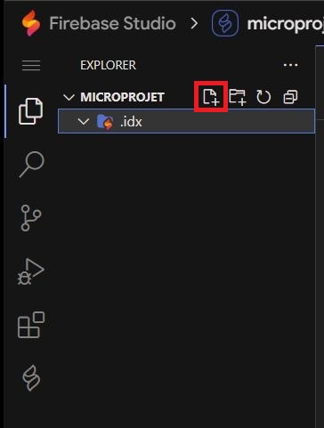
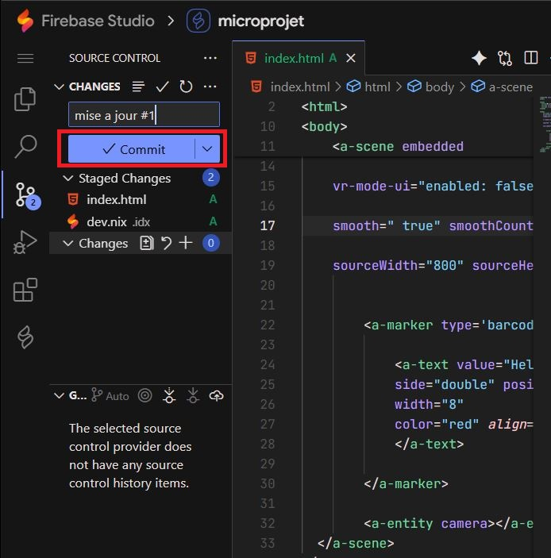
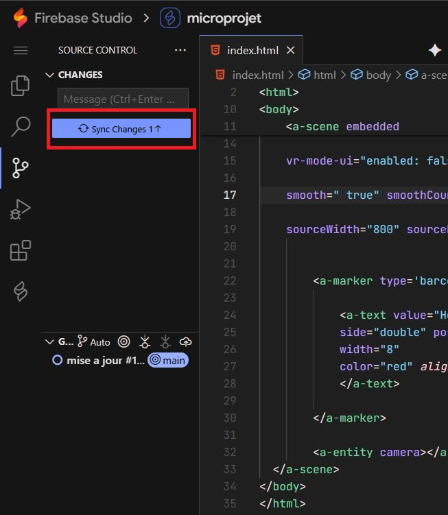
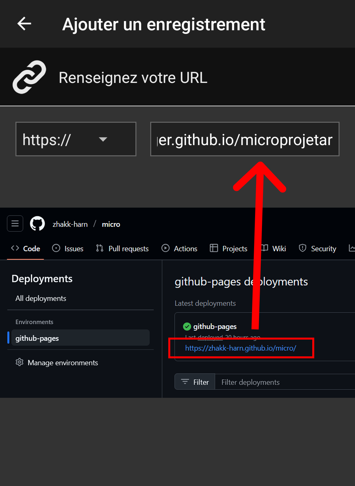

# Introduction
In this tutorial, we will guide you step by step in creating a simple augmented reality (AR) web application.

https://github.com/user-attachments/assets/f4b1f979-b22c-443c-ae03-740b0111a7f0

The goal is to see together the entire technical chain that allows a project to exist as a web page. We will also see how to write information on RFID chips.

We will use A-Frame, an open-source web framework for creating VR/AR experiences, and AR.js, a JavaScript library that allows integrating AR functionalities into web applications.

Our objective will be to display the text "Hello" on a barcode-type AR marker. Then customize the content.

This small project also includes the creation of a "tag" / "keychain".
<div align="center">
  
  
</div>

We will use different free tools:
- github: to version your code and host your project for free.
- Firebase Studio: which is an IDE (integrated development environment) that allows writing code and connects to github to organize changes in our code.
- nfctools: which is an application for android or iOS that will allow us to write information on our RFID sticker.

# Prerequisites

- have a Github account
- have a Gmail account

- A computer
- A code editor our tool will be: [Firebase Studio](https://studio.firebase.google.com)
- A web browser (Chrome, Firefox ...)
- A smartphone with a web browser (Chrome, Firefox ...)


# Materials at your disposal
- a small rounded-edge wooden cardboard square
- a sticker cut on matte vinyl
- a small metal cord with a clasp
- a small RFID chip

<div align="center"> 
  
</div>


For assembly, nothing could be simpler:
- stick the sticker on the wooden cardboard square on the location marked by the engraving.
- stick the RFID chip, centered, on the back of this square.
- unscrew the clasp and pass it through the hole.

and there you go! we're ready to move on to the digital part!

If you want more info on this part:
- [Sticker cutting explanations](https://github.com/LucieMrc/SilhouetteCameo_2spi)
- [Laser cutting explanations](https://github.com/b2renger/Introduction_Laser_Beambox)


📽️Speedrun video: 
- this tutorial seems long...
- actually no, it takes less than 10 minutes!
  
https://github.com/user-attachments/assets/0d7ed300-bff6-4171-a3a7-28d8e4be6978 


# Step 1: Create a GitHub account and repository
- Create a GitHub account: If you don't already have one, go to https://github.com/signup?source=login and create an account.

**☢️ The username you choose will be used for the address you'll need to type to see your project. <u>Choose a short name! without spaces, without special characters (accents, cedilla, etc.)</u>**

<div align="center"> 
  
  
</div>

- Create a new repository: Once logged in, click on the "New repository" button. Give your repository a name (for example, "microProjetAr"), add an optional description, and click "Create repository".

<div align="center"> 

</div>
</br>
<div align="center"> 

</div>


# Step 2: Enable GitHub Pages
We will now configure GitHub Pages, to allow our project to be served by github servers when we enter the address: 

 https://*[your-username]*.github.io/*[your-repository]*


- Access settings: In your repository, click on the "Settings" tab, then on the "Pages" tab

<div align="center"> 

</div>
</br>
<div align="center"> 

</div>

- Select the branch: In the "GitHub Pages" section, select the "main" branch (or the main branch of your repository).
- Save changes: Click the "Save" button. Your GitHub Pages site will now be accessible at https://[your-username].github.io/[microprojetAr].

<div align="center"> 

</div>

If you return to your project's home page, you will notice after a few minutes that some elements have changed. A deployment is now available!

<div align="center"> 

</div>

All the infrastructure necessary to host your project is therefore in place, now you just need to add content.


# Step 3: Use Firebase Studio

Go to [Firebase Studio](https://studio.firebase.google.com) and log in.

Import the repository: Use the option to import your GitHub repository.

<div align="center"> 

</div>

Copy the address of the repository created previously.
<div align="center"> 


</div>

Configure the project for web development use.

- Create a ".idx" folder:
  <div align="center"> 
  
  </div>

- In this folder, create a file named "dev.nix"
  <div align="center"> 
  
  </div>
  To achieve this result:
   <div align="center"> 
  
  </div>

- Copy the development environment configuration code into the "dev.nix" file you just created. (This file will allow us to test our code directly in Firebase Studio and also test on our phone).
  ```nix
    # To learn more about how to use Nix to configure your environment
  # see: https://developers.google.com/idx/guides/customize-idx-env
  { pkgs, ... }: {
    # Which nixpkgs channel to use.
    channel = "stable-23.11"; # or "unstable"
    # Use https://search.nixos.org/packages to find packages
    packages = [
      pkgs.nodejs_20
      pkgs.python3
    ];
    # Sets environment variables in the workspace
    env = {};
    idx = {
      # Search for the extensions you want on https://open-vsx.org/ and use   "publisher.id"
      extensions = [
        # "vscodevim.vim"
      ];
      # Enable previews and customize configuration
      previews = {
        enable = true;
        previews = {
          web = {
            command = ["python3" "-m" "http.server" "$PORT" "--bind" "0.0.0.0"];
            manager = "web";
          };
        };
      };
      # Workspace lifecycle hooks
      workspace = {
        # Runs when a workspace is first created
        onCreate = {
          # Example: install JS dependencies from NPM
          # npm-install = "npm install";
          # Open editors for the following files by default, if they exist:
          default.openFiles = [ "style.css" "main.js" "index.html" ];
        };
        # Runs when the workspace is (re)started
        onStart = {
          # Example: start a background task to watch and re-build backend code
          # watch-backend = "npm run watch-backend";
        };
      };
    };
  }
  ```
Your work environment should look like this:
   
  <div align="center"> 
  
  </div>

All you have to do is click the "Rebuild Environment" button and you're good to go!

In theory Firebase Studio should reload to take into account the changes specified in the `dev.nix` but if this is not the case, use the palette with `Ctrl + Shift + P` (`Cmd + Shift + P` on Mac) and search for "rebuild" to find the "rebuild environment" option.


# Step 4: Create the HTML page

Create an index.html file: In your Firebase Studio, create a file named **"index.html"**.

<div align="center"> 

</div>


Add the HTML code: Copy and paste the following HTML code into your index.html file:

```HTML
<!DOCTYPE html>
<html>

<head>
  <title>My first AR app</title>
  <script src="https://aframe.io/releases/1.6.0/aframe.min.js"></script>
  <script src="https://raw.githack.com/AR-js-org/AR.js/master/aframe/build/aframe-ar.js"></script> 
</head>

<body>
    <a-scene embedded
    arjs="sourceType: webcam; detectionMode: mono_and_matrix; matrixCodeType: 3x3; trackingMethod: best ; changeMatrixMode: modelViewMatrix;"
    renderer="sortObjects: true; antialias: true; colorManagement: true; logarithmicDepthBuffer: true;"

    vr-mode-ui="enabled: false"

    smooth=" true" smoothCount="5" smoothTolerance=".05" smoothThreshold="5"
    
    sourceWidth="800" sourceHeight="600" displayWidth="1280" displayHeight="720">

      
        <a-marker type='barcode' value='0'>
   
            <a-text value="Hello !" 
            side="double" position = "0 0 -1" rotation="270 0 0" 
            width="8"
            color="red" align="center" >
            </a-text>

        </a-marker>

        <a-entity camera></a-entity>
  </a-scene>
</body>
</html>
```


# Step 5: Understanding the code
This code creates a simple augmented reality (AR) experience using A-Frame and AR.js. Let's break down what each part does:

If you're not comfortable and don't know at all how HTML code works, click on the little triangle to unfold an explanation of HTML syntax basics

<details > <summary> <b>&#128161 HTML basics</b> </summary>

An HTML page is like a sandwich. It needs top bread and bottom bread to contain the filling!

The top and bottom bread are the ```<html>``` and ```</html>``` tags. They tell the browser that the content between these tags is HTML code.

Two main parts: Inside the "HTML sandwich", we find two parts:

**The head** (```<head>``` and ```</head>```): It's like the information on the sandwich packaging. We put important information for the browser there, but which is not displayed directly to the user.

For example:
- The page title ```<title>``` which describes to the browser what to display in the tab bar.

- Links to CSS files to load the layout

- Links to JavaScript files for interactive functionalities

**The body** (```<body>``` and ```</body>```): It's the sandwich filling! It's the visible content of the web page: text, images, videos, etc.

The syntax and therefore the interpretation by the browser of html code is based on opening and closing tags:

- The **opening** tag (for example ```<p>```) tells the browser: "Attention, we're starting a paragraph!"
- The closing tag (for example ```</p>```) says: "There, the paragraph is finished."

All content between the opening tag and the closing tag is considered part of this element.

Example:
```html
<html>
<head>
  <title>My web page</title>
</head>
<body>
  <h1>Welcome!</h1>
  <p>This is a text paragraph.</p>
</body>
</html>
```
In this example:

- ```<html>``` opens the HTML page and ```</html>``` closes it.
- ```<head>``` opens the header section and ```</head>``` closes it.
- ```<title>``` opens the page title and ```</title>``` closes it.
- ```<body>``` opens the page body and ```</body>``` closes it.
- ```<h1>``` opens a level 1 title and ```</h1>``` closes it.
- ```<p>``` opens a paragraph and ```</p>``` closes it.

</details>
</br>

Here we have a classic HTML structure: The code sets up a basic HTML page with <head> and <body> sections.


In the ```<head>``` part, we add: 

- le titre de l'expérience
  ```html
  <title>Ma première app AR</title>
  ```

- la *Bibliothèque A-Frame* : Il inclut la bibliothèque A-Frame (aframe.min.js) qui est un framework JavaScript permettant de créer des expériences de réalité virtuelle (RV) et de RA en utilisant du HTML.
Une bibliothèque est simplement du code que l'on ammène dans le projet pour ajouter des fonctionnalités supplémentaires. Un framework est une bibliothèque qui nécessite de respecter certaines regles pour bien marcher, mais en echange un framework est plus puissante qu'une bibliothèque normale.
  ```html
  <script src="https://aframe.io/releases/1.3.0/aframe.min.js"></script>
  ``` 

- la *Bibliothèque AR.js* : Il inclut la bibliothèque AR.js (aframe-ar.js) qui ajoute des capacités de RA à A-Frame.
  ```html
  <script src="https://raw.githubusercontent.com/jeromeetienne/AR.js/master/aframe/build/aframe-ar.js"></script>  
  ```

Dans la partie ```<body>```, et c'est ici que tout ce joue pour le contenu visible par l'utilisateur. Nous ajoutons : 

- la *scène RA* : L'élément ```<a-scene>``` crée la scène de RA.
  ```html
  <a-scene embedded
    arjs="sourceType: webcam; detectionMode: mono_and_matrix; matrixCodeType: 3x3; trackingMethod: best ; changeMatrixMode: modelViewMatrix;"
    renderer="sortObjects: true; antialias: true; colorManagement: true; physicallyCorrectLights; logarithmicDepthBuffer: true;"

    vr-mode-ui="enabled: false"

    smooth=" true" smoothCount="5" smoothTolerance=".05" smoothThreshold="5"
    
    sourceWidth="800" sourceHeight="600" displayWidth="1280" displayHeight="720">

        <!-- contenu de l'expérience AR avec d'autres balises -->

  </a-scene>
  ```
  Remarquez que dans la balise ouvrante ```<a-scene>``` nous ajoutons beaucoup d'options (qui s'appellent attributs en html)  pour configuer la manière dont la scène va s'afficher.

  <details > <summary> <b>&#128161 les détails des options de configuration de l'attribut arjs</b> </summary>
  - *embedded* : Cet attribut indique à A-Frame d'intégrer la scène dans la page HTML.

  - *arjs* : Cet attribut configure AR.js 
    - *sourceType: webcam* : Utilise la webcam de l'appareil comme source vidéo.
    - *detectionMode: mono_and_matrix* : Détecte à la fois les images cibles et les marqueurs de type code-barres.
    - *matrixCodeType: 3x3* : Spécifie que le type de code-barres utilisé est un code-barres matriciel 3x3.
    - *trackingMethod: best* : Utilise la meilleure méthode de suivi disponible.
    - *changeMatrixMode: modelViewMatrix* : Mode de changement de matrice pour le suivi.
    - *vr-mode-ui="enabled: false"* : Désactive l'interface utilisateur du mode VR.
    - *renderer*. Configure le rendu de la scène avec des options pour le tri des objets, l'antialiasing, la gestion des couleurs, etc.
    - *smooth* : Active le lissage du mouvement de la caméra.
  </details>
  </br>

- Le *marqueur* : L'élément ```<a-marker>``` définit un marqueur de type code-barres avec la valeur '2'. Lorsque la caméra détecte ce marqueur, le contenu à l'intérieur de la balise sera affiché en RA.
  ```html
  <a-marker type='barcode' value='0'>
    <!-- ajouter du contenu qui sera visible par l'utilisateur et donc ancré sur notre marqueur -->
  </a-marker>
  ```
  Ici la valeur 2 correspond à un motif précis qui a été prédécoupé pour vous à la [découpeuse de stickers](https://github.com/LucieMrc/SilhouetteCameo_2spi). Avec la technique que nous utilisons [il existe 64 motifs différents](https://github.com/b2renger/Introduction_A-frame/blob/main/markers/barcodes/2.png) qui peuvent être détectés en même temps par arjs.

- Un texte : L'élément <a-text> crée un texte en 3D qui sera affiché au-dessus du marqueur. Le texte est "Hello !", de couleur rouge et centré.
  ```html
  <a-text value="Hello !" 
            side="double" position = "0 0 -1" rotation="270 0 0" 
            width="8"
            color="red" align="center" >
  </a-text>
  ```
    <details > <summary> <b>&#128161 les détails des attributs de la balise a-text</b> </summary>
  - *value* : Le texte à afficher.
  - *side=double* : permet d'afficher le texte quelque soit l'angle sous lequel on le regarde.
  - *position="0 0 -1" : la position xyz du centre du texte par rapport au centre du marqueur.
  - *rotation="270 0 0"* :
  - *width="8"* : la largeur du texte.
  - *color="red"* : la couleur du texte.
  - *align="center"* : l'alignement du texte.
  </details>
  </br>

- Caméra : L'élément ```<a-entity camera>``` définit la caméra de la scène, le fonctionnement par défaut nous convient parfaitement, mais il est possible d'ajouter des fonctionalités comme par exemple l'interaction via l'orientation du regard ('gaze' interaction).


En résumé, ce code crée une expérience de RA où un texte apparaît dans un esapce 3D lorsque le marqueur code-barres 2 est détecté par la caméra.


# Étape 6 : Tester

- Enregistrer les modifications : Enregistrez votre fichier index.html.

- Tester votre projet : Affichez la webview de votre projet.

  Pour ouvrir la preview de votre app, cherchez "web" dans la palette pour trouver "Show Web Preview". (rappel: la palette c'est `Ctrl/Cmd + Shift + P`).


  <div align="center"> 
  
  </div>

  Vous pouvez alors visionner votre page en plein écran en cliquant sur le petit icône en haut à droite.

  <div align="center"> 
  
  </div>

  Cela ouvrira votre expérience dans un nouvel onglet sur votre ordinateur. A ce stade vous devriez voir : une page web vous montrant vous !

  Si vous montrez le marqueur à la caméra vous devriez voir ceci :

  <div align="center"> 
  
  </div>

  Votre projet fonctionne donc dans l'éditeur et avec la caméra de votre ordinateur.

  Vous pouvez maintenant le tester sur votre smartphone. Il vous suffit de vous rendre sur la page que vous venez d'ouvrir.

  Pour cela vous pouvez cliquer sur l'icône "lien" en haut à droite à côté de l'icône pour ouvrir dans une nouvelle fenêtre. Scannez le qr code et vous voilà avec la page chargée sur votre téléphone.

  <div align="center"> 
  
  </div>

  
Vous pouvez ensuite répéter ces opérations en changeant le code, sauvegardant et en actualisant la page. 

Essayer par exemple de changer le texte, sa couleur, sa taille, sa position etc.


# Étape 7 : Publier l'application

Commiter les modifications : Utilisez les outils de versioning de Firebase Studio pour commiter vos changements et les pousser sur votre dépôt GitHub.

- Cliquer sur le bouton source control de Firebase Studio
  <div align="center"> 
  
  </div>

- 'Stager' les changements en cliquant sur le "+"
  <div align="center"> 
  
  </div>

- 'Commiter' les changements en cliquant sur le bouton 'commit'
  <div align="center"> 
  
  </div>

- Synchroniser les changements en cliquant sur le bouton 'commit'
  <div align="center"> 
  
  </div>

Cette dernière opération va envoyer vos changements à votre dépot github et du coup mettre à jour la page mise en ligne.

**Votre expérience est maintenant déployée à l'adresse :** *https://[votre-nom-utilisateur].github.io/[votre-depot]*

**✨	 Félicitations ! ✨**  Vous avez créé votre première application AR. Vous pouvez maintenant personnaliser votre application en modifiant le texte, en ajoutant des modèles 3D, et en expérimentant avec différentes fonctionnalités d'A-Frame et AR.js.

Note : Ce tutoriel est une introduction de base. Pour approfondir vos connaissances, consultez la documentation officielle d'A-Frame et AR.js.

 #  Étape 8 : Encoder le sticker RFID

Notre but est de programmer notre sticker RFID pour que lorsque nous approchons notre téléphone, celui-ci va nous proposer d'ouvrir la page web hébergeant notre projet.

Pour cela nous allons utiliser NFCTools qui est gratuit et qui est disponible pour [Android](https://play.google.com/store/apps/details?id=com.wakdev.wdnfc&hl=fr) ou [iOS](https://apps.apple.com/fr/app/nfc-tools/id1252962749)?.

- Choisir l'onglet "Ecrire" et sélectionner "ajouter un enregistrement"
  <div align="center"> 
  
  </div>
- Choisir "URL/URI"
  <div align="center"> 
  
  </div>
- Entrer l'adresse de votre page puis valider
  <div align="center"> 
  
  </div>
- Vous pouvez maintenant cliquer sur le bouton "Ecrire" sous le champ "Plus d'options"
  <div align="center"> 
  
  </div>
- Vous devrier voir cet écran vous demandant d'approcher votre smartphone du sticker.
  <div align="center"> 
  
  </div>
- Une fois que vous avez réussi à détecter votre sticker, l'écriture devrait s'effectuer
  <div align="center"> 
  
  </div>

Normalement c'est bon !
Vous pouvez fermer NFCTools et tester !


# Pour aller plus loin ...

Un cours entier en anglais est disponible sur [le site de l'ateliernum](http://ateliernum.github.io) à cette adresse : https://github.com/b2renger/Introduction_A-frame#introduction_a-frame

Personnaliser l'apparence : Ajouter d'autres éléments, modifier les couleurs, les tailles et les positions des éléments.

Ajouter des modèles 3D : Importer des modèles 3D dans votre scène.

Utiliser d'autres types de marqueurs : Explorer les différents types de marqueurs AR.

Créer des interactions : Ajouter des événements et des interactions à votre application.
